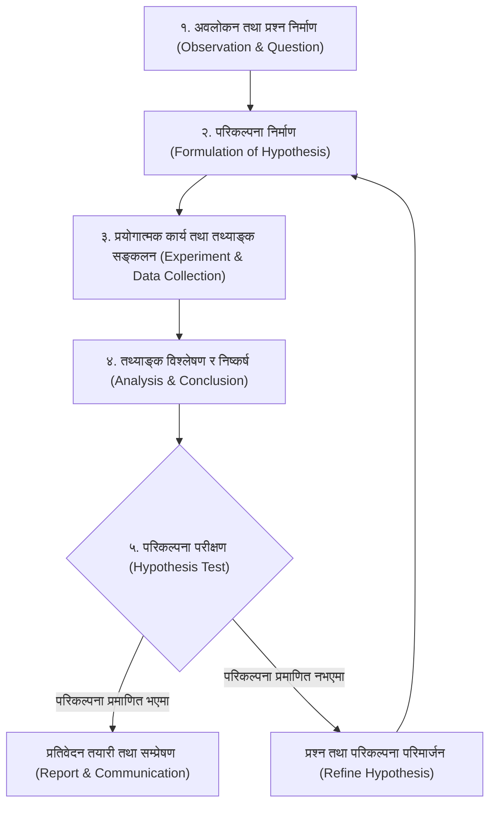

# कक्षा ९ विज्ञान तथा प्रविधि — एकाइ १: वैज्ञानिक अध्ययन (Scientific Study)
## विस्तृत अध्ययन टिपोट तथा नमुना प्रश्नोत्तर (Comprehensive Study Notes & Tiered Model Questions)

---

### १. सैद्धान्तिक अवधारणा तथा मुख्य विषयवस्तु (Core Theoretical Foundations)

#### १.१ विज्ञान र वैज्ञानिक अध्ययन (Science and Scientific Study)
- **विज्ञानको परिभाषा:** प्रकृतिमा घट्ने विभिन्न घटनाहरूको कारण, नियम र सत्यता पत्ता लगाउन गरिने व्यवस्थित, प्रमाणमा आधारित र प्रयोगात्मक अध्ययनलाई **विज्ञान (Science)** भनिन्छ।
- **वैज्ञानिक सिकाइका सीपहरू (Science Process Skills):**
  1. **अवलोकन (Observing):** ज्ञानेन्द्रिय तथा उपकरण प्रयोग गरी वस्तु वा घटनाको गहिरो अध्ययन गर्ने।
  2. **प्रश्न सोध्ने (Questioning):** समस्याका सम्बन्धमा 'किन', 'कसरी', 'के कारणले' जस्ता खोजमूलक प्रश्न उठाउने।
  3. **वर्गीकरण (Classifying):** समानता र भिन्नताका आधारमा समूह विभाजन गर्ने।
  4. **अनुमान (Predicting/Inferring):** विगतका ज्ञान र अवलोकनका आधारमा सम्भावित नतिजाको अड्कल काट्ने।
  5. **मापन (Measuring):** मानक उपकरण प्रयोग गरी भौतिक परिमाणको सङ्ख्यात्मक मान निकाल्ने।
  6. **व्याख्या (Interpreting):** सङ्कलित तथ्याङ्कलाई तार्किक अर्थ दिने।
  7. **निष्कर्ष (Concluding):** प्रमाणका आधारमा अन्तिम सत्य वा नियम स्थापित गर्ने।
  8. **सञ्चार (Communicating):** प्राप्त नतिजालाई प्रतिवेदन, ग्राफ, वा छलफलमार्फत अरूलाई जानकारी दिने।

---

#### १.२ वैज्ञानिक पद्धतिका पाँच प्रमुख चरणहरू (Steps of Scientific Method)

1. **समस्या पहिचान र अवलोकन:** प्राकृतिक घटनाको अवलोकनबाट अनुसन्धानयोग्य प्रश्न बनाउने।
2. **परिकल्पना (Hypothesis):** समस्याको अस्थायी तर परीक्षणयोग्य वैज्ञानिक अनुमान वा सम्भावित उत्तर।
3. **प्रयोग (Experiment):** चरहरू (स्वतन्त्र चर, निर्भर चर र नियन्त्रित चर) बीचको सम्बन्ध जाँच्न गरिने नियन्त्रित क्रियाकलाप।
4. **तथ्याङ्क विश्लेषण:** तालिका, ग्राफ वा गणितीय विधिको प्रयोगबाट नतिजा पहिल्याउने।
5. **निष्कर्ष र प्रतिवेदन:** परिकल्पना सत्य प्रमाणित भए नयाँ नियम/सिद्धान्तका रूपमा प्रतिवेदन लेख्ने, नभए परिकल्पना संशोधन गर्ने।

---

#### १.३ विज्ञानका मुख्य क्षेत्रहरू तथा अन्तरसम्बन्ध (Fields of Science)
1. **जीव विज्ञान (Biology):** सजीव, कोष, वनस्पति तथा प्राणीहरूको जीवन प्रक्रियाको अध्ययन। (प्रमुख व्यक्तित्व: ग्रेगर जोन मेन्डेल, डा. सन्दुक रुइत)।
2. **भौतिक विज्ञान (Physics):** पदार्थ, ऊर्जा, बल, चाल, गुरुत्वाकर्षण, प्रकाश र अन्तरिक्षको अध्ययन। (प्रमुख व्यक्तित्व: सर आइज्याक न्युटन, अल्बर्ट आइन्स्टाइन, स्टिफन हकिङ)।
3. **रसायन विज्ञान (Chemistry):** परमाणु, अणु, तत्त्व, यौगिक र रासायनिक प्रतिक्रियाको अध्ययन। (प्रमुख व्यक्तित्व: जोन डाल्टन, दिमित्रि मेन्डेलिभ)।
4. **अन्तरविषयक क्षेत्रहरू (Interdisciplinary Branches):**
   - **बायोफिजिक्स (Biophysics):** जीव विज्ञानमा भौतिक यन्त्र र नियमहरूको प्रयोग (जस्तै: लेन्सबाट आँखाको उपचार, एक्स-रे, एमआरआई)।
   - **बायोकेमेस्ट्री (Biochemistry):** जीवित कोषहरूमा हुने रासायनिक प्रक्रिया (जस्तै: पाचन, श्वासप्रश्वास, इन्जाइम कार्य)।
   - **कृषि विज्ञान (Agricultural Science):** माटो, बाली र प्रविधिको संयुक्त वैज्ञानिक अध्ययन।

---

#### १.४ मेट्रिक उपसर्गहरू (Metric Prefixes)
दैनिक जीवन र वैज्ञानिक अध्ययनमा धेरै ठूला र धेरै साना परिमाणहरूलाई संक्षिप्त बनाउन १० को घाताङ्कसँग सम्बद्ध **मेट्रिक उपसर्ग** प्रयोग गरिन्छ:

| उपसर्ग (Prefix) | सङ्केत (Symbol) | घाताङ्क मान (Multiplier) | साधारण अङ्कमा मान | उदाहरण |
| :--- | :---: | :---: | :--- | :--- |
| **Tera (टेरा)** | $\text{T}$ | $10^{12}$ | $1,000,000,000,000$ | $1\text{ TB} = 10^{12}\text{ Bytes}$ |
| **Giga (गिगा)** | $\text{G}$ | $10^9$ | $1,000,000,000$ | $1\text{ GHz} = 10^9\text{ Hz}$ |
| **Mega (मेगा)** | $\text{M}$ | $10^6$ | $1,000,000$ | $1\text{ MW} = 10^6\text{ W}$ |
| **Kilo (किलो)** | $\text{k}$ | $10^3$ | $1,000$ | $1\text{ km} = 10^3\text{ m}$ |
| **Hecto (हेक्टो)** | $\text{h}$ | $10^2$ | $100$ | $1\text{ hm} = 100\text{ m}$ |
| **Deca (डेका)** | $\text{da}$ | $10^1$ | $10$ | $1\text{ dam} = 10\text{ m}$ |
| *(आधार एकाइ)* | — | $10^0 = 1$ | $1$ | मिटर, ग्राम, सेकेन्ड |
| **Deci (डेसि)** | $\text{d}$ | $10^{-1}$ | $0.1$ | $1\text{ dm} = 0.1\text{ m}$ |
| **Centi (सेन्टि)** | $\text{c}$ | $10^{-2}$ | $0.01$ | $1\text{ cm} = 0.01\text{ m}$ |
| **Milli (मिली)** | $\text{m}$ | $10^{-3}$ | $0.001$ | $1\text{ mm} = 0.001\text{ m}$ |
| **Micro (माइक्रो)** | $\mu$ | $10^{-6}$ | $0.000001$ | $1\text{ }\mu\text{m} = 10^{-6}\text{ m}$ |
| **Nano (नानो)** | $\text{n}$ | $10^{-9}$ | $0.000000001$ | $1\text{ nm} = 10^{-9}\text{ m}$ |
| **Pico (पिको)** | $\text{p}$ | $10^{-12}$ | $0.000000000001$ | $1\text{ pm} = 10^{-12}\text{ m}$ |

---

#### १.५ वैज्ञानिक सङ्केतन (Scientific Notation)
- **परिभाषा:** कुनै पनि सङ्ख्यालाई $M \times 10^n$ को ढाँचामा लेख्ने पद्धति, जहाँ $1 \le M < 10$ र $n$ कुनै पूर्णाङ्क हो।
- **नियमहरू:**
  1. बायाँबाट पहिलो शून्यबाहेकको अङ्कपछि मात्र दशमलव राखिन्छ।
  2. दशमलव बायाँ सार्दा १० को घाताङ्क धनात्मक ($+n$) हुन्छ।
  3. दशमलव दायाँ सार्दा १० को घाताङ्क ऋणात्मक ($-n$) हुन्छ।
  4. जस्तै:
     - प्रकाशको गति $= 300,000,000\text{ m/s} = 3 \times 10^8\text{ m/s}$
     - रातो रक्तकोषको आकार $= 0.000007\text{ m} = 7 \times 10^{-6}\text{ m}$

---

#### १.६ न्यूनतम नाप र मापनको यथार्थता (Least Count & Precision)
- **न्यूनतम नाप (Least Count):** कुनै पनि उपकरणले नाप्न सक्ने सबैभन्दा सानो परिमाण।
  - साधारण स्केल: $1\text{ mm} = 0.1\text{ cm}$
  - भर्नियर क्यालिपर: $0.1\text{ mm} = 0.01\text{ cm}$
  - स्क्रू गज: $0.01\text{ mm} = 0.001\text{ cm}$
- **यथार्थता (Accuracy) र सूक्ष्मता (Precision):**
  - **Accuracy:** नापिएको मान वास्तविक मान (True value) सँग कति नजिक छ।
  - **Precision:** बारम्बार नाप्दा नतिजाहरू आपसमा कति नजिक र एकरूप छन्।
- **औसत नाप (Average Measurement):** मानिसको प्रतिक्रिया समय र वातावरणीय परिवर्तनले गर्दा एकै पटकको नापमा त्रुटि हुन सक्छ। कम्तीमा ३ पटक नाप लिई औसत निकाल्दा सम्भावित आकस्मिक त्रुटि घट्छ।

---

#### १.७ प्रयोगशाला सुरक्षा तथा खतराका सङ्केतहरू (Lab Safety & Hazard Symbols)
- **सुरक्षा नियमहरू:** ल्याब कोट, चस्मा र पन्जाको अनिवार्य प्रयोग; शिक्षकको अनुपस्थितिमा रसायन नछुनु; रसायन नचाख्नु; अग्निनियन्त्रक यन्त्रको व्यवस्था।
- **खतराका मुख्य सङ्केतहरू (Hazard Warning Symbols):**
  - 🔥 **ज्वलनशील (Flammable):** आगो लाग्न सक्ने (जस्तै: अल्कोहल, ईथर)।
  - ☠️ **विषाक्त (Toxic/Poisonous):** ज्यान जोखिममा पार्न सक्ने (जस्तै: साइनाइड, मर्करी)।
  - 🧪 **संक्षारक (Corrosive):** छाला वा धातु खियाउने/जलाउने (जस्तै: कडा अम्ल $\text{H}_2\text{SO}_4$, कडा क्षार $\text{NaOH}$)।
  - 💥 **विस्फोटक (Explosive):** घर्षण वा तापले पड्किने (जस्तै: टिएनटी, बारुद)।
  - ☣️ **जैविक जोखिम (Biohazard):** रोग सार्ने जीवाणु/भाइरस।
  - ☢️ **रेडियोधर्मी (Radioactive):** हानिकारक विकिरण फाल्ने (जस्तै: युरेनियम)।

---

### २. तीन तहका परीक्षा केन्द्रित नमुना प्रश्नोत्तर (16 Tiered Model Questions)

#### तह १: ज्ञान तह (Knowledge - 5 Questions)

**प्रश्न १: वैज्ञानिक अध्ययन भनेको के हो?**  
**उत्तर:**  
प्रकृतिका विभिन्न घटना, वस्तु तथा तथ्यहरूको अवलोकन, परिकल्पना, प्रयोगात्मक परीक्षण र निष्कर्षका आधारमा ज्ञान हासिल गर्ने व्यवस्थित र तार्किक प्रक्रियालाई वैज्ञानिक अध्ययन भनिन्छ।

**प्रश्न २: कुनै उपकरणको 'न्यूनतम नाप (Least Count)' भन्नाले के बुझिन्छ?**  
**उत्तर:**  
कुनै पनि नाप्ने उपकरणले सही रूपमा नाप्न सक्ने सबैभन्दा सानो परिमाणलाई त्यस उपकरणको न्यूनतम नाप भनिन्छ।

**प्रश्न ३: १ गिगामिटर ($\text{Gm}$) मा कति मिटर हुन्छ? घाताङ्कमा लेख्नुहोस्।**  
**उत्तर:**  
$1\text{ Gm} = 10^9\text{ m}$ (अर्थात् १ अर्ब मिटर)।

**प्रश्न ४: प्रयोगशालामा प्रयोग गरिने दुईवटा व्यक्तिगत सुरक्षा सामग्री (PPE) को नाम लेख्नुहोस्।**  
**उत्तर:**  
१. सुरक्षात्मक चस्मा (Safety Goggles)  
२. ल्याब कोट वा एप्रोन (Lab Coat/Apron)

**प्रश्न ५: आधुनिक वंशाणुशास्त्रका पिता (Father of Modern Genetics) कसलाई मानिन्छ?**  
**उत्तर:**  
ग्रेगर जोन मेन्डेल (Gregor Johann Mendel) लाई।

---

#### तह २: बोध तह (Understanding - 6 Questions)

**प्रश्न ६: वैज्ञानिक अध्ययनमा 'परिकल्पना (Hypothesis)' किन महत्वपूर्ण मानिन्छ?**  
**उत्तर:**  
परिकल्पनाले अनुसन्धानकर्तालाई अध्ययनको निश्चित दिशा र दायरा प्रदान गर्छ। यसले समस्याको सम्भावित वैज्ञानिक उत्तर अनुमान गर्न र सो उत्तर परीक्षण गर्न कस्तो प्रयोग गर्ने तथा कुन तथ्याङ्क सङ्कलन गर्ने भन्ने योजना बनाउन मार्गदर्शन गर्दछ।

**प्रश्न ७: वैज्ञानिक पद्धतिमा प्रयोग गर्दा 'औसत नाप' लिनु किन आवश्यक हुन्छ? स्पष्ट पार्नुहोस्।**  
**उत्तर:**  
मानिसको दृष्टि, प्रतिक्रिया समय (reaction time), उपकरणको सूक्ष्म असन्तुलन वा हावाजस्ता वातावरणीय प्रभावले गर्दा एकै पटकको नापमा व्यक्तिगत वा आकस्मिक त्रुटि (random error) हुन सक्छ। त्यसैले प्रयोगलाई कम्तीमा ३ पटक दोहोर्याएर औसत निकाल्दा त्रुटिहरू एकापसमा न्यून भई नाप वास्तविक मानको सबैभन्दा नजिक पुग्दछ।

**प्रश्न ८: जीव विज्ञान र भौतिक विज्ञानबीचको अन्तरसम्बन्धलाई एउटा उपयुक्त उदाहरणसहित प्रस्ट पार्नुहोस्।**  
**उत्तर:**  
भौतिक विज्ञानका नियम र यन्त्रहरू जीव विज्ञानमा जीवन प्रक्रिया बुझ्न र रोगको उपचार गर्न प्रयोग हुन्छन्। उदाहरणका लागि, भौतिक विज्ञानको प्रकाशको अपवर्तन र लेन्सको सिद्धान्त प्रयोग गरेर डा. सन्दुक रुइतले विकास गरेको इन्ट्राअकुलर लेन्स (IOL) मार्फत आँखाको मोतीबिन्दुको सफल शल्यक्रिया गरिन्छ।

**प्रश्न ९: शुद्धता (Accuracy) र सूक्ष्मता (Precision) बीचको भिन्नता उदाहरणसहित लेख्नुहोस्।**  
**उत्तर:**  
- **Accuracy (शुद्धता):** नापिएको मान वास्तविक मान (True value) सँग कति नजिक छ भन्ने अवस्था। जस्तै: कुनै वस्तुको वास्तविक लम्बाइ $5.0\text{ cm}$ भएकोमा नाप $4.99\text{ cm}$ आउनु एक्युरेट हुनु हो।  
- **Precision (सूक्ष्मता):** एकै परिमाणलाई पटक-पटक नाप्दा प्राप्त नतिजाहरू आपसमा कति नजिक छन् भन्ने अवस्था। जस्तै: तीन पटक नाप्दा $4.61\text{ cm}, 4.62\text{ cm}, 4.61\text{ cm}$ आउनु प्रिसिजन उच्च हुनु हो, चाहे त्यो वास्तविक मानभन्दा फरक किन नहोस्।

**प्रश्न १०: कुनै सङ्ख्यालाई वैज्ञानिक सङ्केतनमा लेख्दा आधार अङ्क $M$ को मान किन १ देखि १० को बीचमा हुनुपर्छ?**  
**उत्तर:**  
वैज्ञानिक सङ्केतनलाई अन्तर्राष्ट्रिय रूपमा एकरूप र मानक (standardized) बनाउन आधार अङ्क $M$ को मान $1 \le M < 10$ निर्धारण गरिएको हो। यसो गर्दा दशमलव सधैं पहिलो गैर-शून्य अङ्कपछि मात्र पर्छ, जसले गर्दा सङ्ख्याको आकार सिधै १० को घाताङ्क हेरेर तुरुन्तै तुलना गर्न सकिन्छ।

**प्रश्न ११: रासायनिक प्रयोगशालामा काम गर्दा बोतलमा 'संक्षारक (Corrosive)' सङ्केत देख्दा के कस्ता सावधानी अपनाउनुपर्छ?**  
**उत्तर:**  
संक्षारक रसायन (जस्तै: कन्सन्ट्रेटेड सल्फ्युरिक एसिड, सोडियम हाइड्रोक्साइड) ले छाला, आँखा र धातुलाई छिट्टै जलाउँछ र खियाउँछ। त्यसैले यस्तो सङ्केत देख्दा:  
१. बाक्लो रबरको पन्जा र सुरक्षा चस्मा अनिवार्य लगाउनुपर्छ।  
२. अम्लमा सिधै पानी नहाली, पानीमा विस्तारै अम्ल हाल्दै हल्लाउनुपर्छ।  
३. झुक्किएर छालामा परेमा तुरुन्तै धेरै सफा बगिरहेको पानीले धुनुपर्छ।

---

#### तह ३: प्रयोग तथा उच्च दक्षता तह (Application & Higher Ability - 5 Questions)

**प्रश्न १२: एउटा विद्यार्थीले कुनै तारको व्यास नाप्न साधारण मिटर स्केल प्रयोग गर्दा $1.5\text{ mm}$ प्राप्त गर्यो र अर्को विद्यार्थीले स्क्रू गज प्रयोग गर्दा $1.54\text{ mm}$ प्राप्त गर्यो। कुन नाप बढी भरपर्दो हुन्छ र किन?**  
**उत्तर:**  
स्क्रू गज (Micrometer Screw Gauge) बाट लिइएको $1.54\text{ mm}$ नाप बढी भरपर्दो र यथार्थ हुन्छ।  
**कारण:**  
साधारण मिटर स्केलको न्यूनतम नाप $1\text{ mm}$ मात्र हुन्छ, जसले मिलिमिटरपछिको दशमलव मान यकिन गर्न सक्दैन (विद्यार्थीले अनुमान मात्र गरेको हो)। तर, स्क्रू गजको न्यूनतम नाप $0.01\text{ mm}$ हुने भएकाले यसले मिलिमिटरको सयौं भागसम्मको नाप यथार्थताका साथ मापन गर्दछ।

**प्रश्न १३: एक प्रयोगशालामा पानी तताउँदा समय र तापक्रमको सम्बन्ध अध्ययन गर्न विद्यार्थीले तथ्याङ्क सङ्कलन गरे। यस प्रयोगमा स्वतन्त्र चर (Independent Variable), निर्भर चर (Dependent Variable) र नियन्त्रित चर (Controlled Variable) पहिचान गर्नुहोस्।**  
**उत्तर:**  
- **स्वतन्त्र चर (Independent Variable):** तताएको समय (Time) — किनभने यो समय प्रयोगकर्ताको नियन्त्रणमा निरन्तर बित्छ।  
- **निर्भर चर (Dependent Variable):** पानीको तापक्रम (Temperature) — किनभने यो समय बित्दै जाँदा समयमा निर्भर भएर परिवर्तन हुन्छ।  
- **नियन्त्रित चर (Controlled Variable):** पानीको मात्रा (आयतन), बर्नरको ज्वालाको ताप, र प्रयोग गरिएको भाँडोको प्रकार — जसलाई प्रयोगभरि स्थिर राखिन्छ।

**प्रश्न १४: पृथ्वीको पिण्ड $5972000000000000000000000\text{ kg}$ र हाइड्रोजन परमाणुको पिण्ड $0.00000000000000000000000000167\text{ kg}$ छ। यी दुवै मानहरूलाई वैज्ञानिक सङ्केतनमा रूपान्तरण गरी तुलना गर्नुहोस्।**  
**उत्तर:**  
१. **पृथ्वीको पिण्ड:**  
   दशमलव बिन्दुलाई २४ स्थान बायाँ सार्दा:  
   $$\text{Mass of Earth} = 5.972 \times 10^{24}\text{ kg}$$  
२. **हाइड्रोजन परमाणुको पिण्ड:**  
   दशमलव बिन्दुलाई २७ स्थान दायाँ सार्दा:  
   $$\text{Mass of Hydrogen Atom} = 1.67 \times 10^{-27}\text{ kg}$$  
**तुलना:**  
वैज्ञानिक सङ्केतनले अति विशाल ($10^{24}$) र अति सूक्ष्म ($10^{-27}$) परिमाणहरूलाई सहजै एकै मानक ढाँचामा हेर्न, तुलना गर्न र शून्य गन्नुपर्ने झन्झट हटाउन सक्षम बनाएको छ।

**प्रश्न १५: "यदि कुनै अनुसन्धानमा परिकल्पना गलत प्रमाणित भयो भने त्यो प्रयोग पूर्ण रूपमा असफल भएको मानिन्छ।" के तपाईं यो भनाइसँग सहमत हुनुहुन्छ? आफ्नो वैज्ञानिक तर्क दिनुहोस्।**  
**उत्तर:**  
म यस भनाइसँग **सहमत छैन**।  
**वैज्ञानिक तर्क:**  
विज्ञानमा परिकल्पना गलत प्रमाणित हुनु प्रयोगको असफलता होइन; बरु त्यो सत्यको नजिक पुग्ने नयाँ सिकाइ हो। परिकल्पना गलत हुनुको अर्थ त्यो बाटो वा अनुमान सही थिएन भन्ने ठोस प्रमाण फेला पर्नु हो। यसले वैज्ञानिकहरूलाई गलत बाटो छोडेर प्रश्न र परिकल्पना परिमार्जन गर्न मद्दत गर्छ र अन्ततः वास्तविक नियम पत्ता लगाउन मार्गप्रशस्त गर्छ। थोमस एल्भा एडिसनले बल्बको फिलामेन्ट बनाउँदा हजारौं असफल प्रयासपछि मात्र सही पदार्थ फेला पारेका थिए।

**प्रश्न १६: विज्ञान प्रयोगशालामा सुरक्षित काम गर्नका लागि विद्यार्थी आचारसंहिता (Code of Conduct) को ५ बुँदे कार्ययोजना तयार गर्नुहोस्।**  
**उत्तर:**  
**विद्यार्थी प्रयोगशाला आचारसंहिता (Code of Conduct):**  
१. **व्यक्तिगत पूर्वतयारी:** प्रयोगशाला प्रवेश गर्दा अनिवार्य रूपमा एप्रोन, पन्जा र सुरक्षात्मक चस्मा लगाउने तथा लामो कपाल बाँध्ने।  
२. **अनुमतिबिना प्रयोग निषेध:** शिक्षक वा ल्याब इन्चार्जको स्पष्ट निर्देशन र उपस्थितिबिना कुनै पनि रसायन, उपकरण वा ग्यास नखोल्ने।  
३. **चेतावनी सङ्केतको पालना:** प्रत्येक रसायनको बोतलमा रहेको खतराको चिन्ह (Hazard Symbol) हेरेर मात्र सावधानीपूर्वक ह्यान्डल गर्ने, कहिल्यै नचाख्ने वा सिधै नसुँघ्ने।  
४. **आपत्कालीन सचेतना:** कुनै रसायन पोखिएमा वा सिसा फुटेमा तुरुन्तै शिक्षकलाई खबर गर्ने र प्राथमिक उपचार बाकस तथा अग्निनियन्त्रकको स्थानबारे जानकार रहने।  
५. **सफा र व्यवस्थित विसर्जन:** प्रयोग सकिनासाथ रासायनिक फोहोर तोकिएको भाँडोमा विसर्जन गर्ने, सिसाका सामान धोएर सुरक्षित ठाउँमा राख्ने र साबुनपानीले हात धोएर मात्र बाहिर निस्कने।
